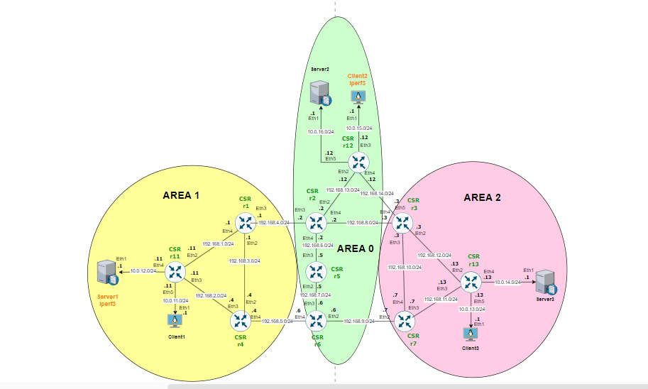
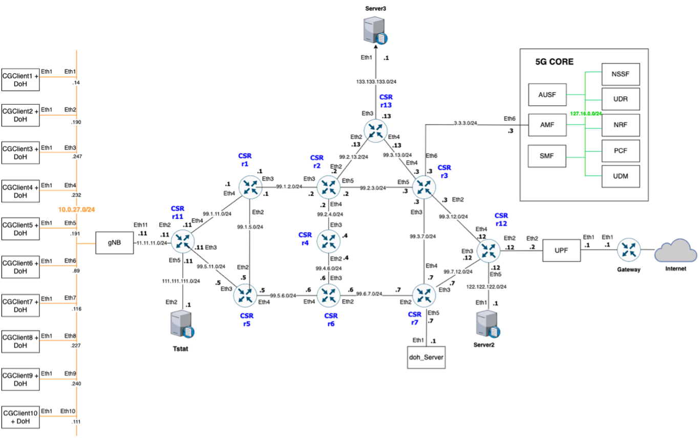

# Network Digital Twin Protype

Technical features of the deployment of the NDT prototype can be found in this repository. For this use case the scenario is deployed on a container infrastructure using kubernetes as the management tool. Among all the tools that were considered in the first instance, Kubernetes was finally chosen as it allows dynamic working and efficient management of architectures that consume large computational resources. 

In order to emulate the aspects of the behaviour of network equipment without actually using any target real-world networking hardware, [KNE](#https://github.com/openconfig/kne) (Kubernetes Network Emulator by [OpenConfig](#https://www.openconfig.net)) is used.  

The selected tools, the integration process and the scenario descriptors are detailed in the following sections.

# Table of Contents

  - [Prerequisites](#prerequisites)
  - [Installation procedure](#installation-procedure)
  - [Topology setup example](#topology-setup-example)
  - [DoH/DDoS attack use case](#dohddos-attack-use-case)

# Prerequisites

- A Kubernetes cluster, running Kubernetes 1.13.0 or later, that does not already  have network load-balancing functionality. _Tested on a 4-node cluster, with kubernetes v1.27.3._
- SO Resources: 
  - Ubuntu 20.04.6 LTS. _GNU/Linux 5.4.0-156-generic x86_64_
  - RAM: 10GB 
  - vCPUs: 8
- MetalLB is used as Load Balancer: https://metallb.universe.tf/installation/
  - A cluster network configuration that can coexist with MetalLB.
  - Some IPv4 addresses for MetalLB to hand out.
  - When using the BGP operating mode, you will need one or more routers capable of speaking BGP.
When using the L2 operating mode, traffic on port 7946 (TCP & UDP, other port can be configured) must be allowed between nodes, as required by memberlist. 
- KNE: https://github.com/openconfig/kne
- Docker is used as CRI https://docs.docker.com/engine/install/. _Tested with version 20.10.21_.
- Python 3 (_Tested with version Python 3.8.10_).
- Python library for NETCONF client _ncclient_: https://github.com/ncclient/ncclient
- Python library for [`Apache Kafka`](https://kafka.apache.org/) client _confluent-kafka_: https://github.com/confluentinc/confluent-kafka-python
- Go (_Tested with version 1.20.1_).
- Router images license
- A CISCO IOS XE qcow2 image file for CSR 1000v network devices must be converted and imported as a containerized image in Docker with `vrnetlab` tool, so that it can be used with ContainerLab: https://github.com/hellt/vrnetlab/tree/master/csr. _Tested with `Cisco IOS XE CSR1000v 17.3.4a` (a.k.a. `17.03.04a`) and `Cisco IOS XE CSR1000v 17.3.6` (a.k.a. `17.03.06`) models_. Already containerized `Cisco IOS XE CSR1000v` routers consume a large amount of computing resources on the local machine (on the order of 4GB of RAM and 1-2 CPU/vCPU cores per containerized router).

# Installation procedure

The following steps provide a guide to integrating the [hellt/vrnetlab](https://github.com/hellt/vrnetlab "hellt/vrnetlab") project on a kubernetes architecture with the [KNE](https://github.com/openconfig/kne "KNE") project, for deploying network topologies in a multi-node cluster. Vrnetlab allows to run virtual routers in docker.

The installation procedure is detailed for a 4-node kubernetes cluster below.

#### 1. Clone KNE repository from the cluster controller: 

```bash
ssh <user_name@controlplane_name>
git clone https://github.com/openconfig/kne.git
```
#### 2. Within the kne folder, install the binary:

```bash
cd kne
make install
```
#### 3. Install Golang:
If golang is already installed then check the version using go version. If 1.20 or newer then golang installation is complete.

Install the new version.

  ```bash
 curl -O https://dl.google.com/go/go1.20.1.linux-amd64.tar.gz
 sudo rm -rf /usr/local/go && sudo tar -C /usr/local -xzf go1.20.1.linux- amd64.tar.gz
 rm go1.20.1.linux-amd64.tar.gz  
 ```

Consider adding the export commands to ~/.bashrc or similar.
  ```bash
  export PATH=$PATH:/usr/local/go/bin
  export PATH=$PATH:$(go env GOPATH)/bin
   ```
#### 4. Install Docker:
It is required to have docker installed on all cluster nodes, in case it is not installed follow these [steps](https://docs.docker.com/engine/install/ubuntu/#install-using-the-repository).

Follow the post-installation steps for Linux. Specifically manager docker as a non-root user.
  ```bash
sudo groupadd docker
sudo usermod -aG docker $USER
   ```
#### 5. KNE Dependencies

The `kne deploy` command is used to setup a cluster as well as ingress, CNI, and vendor controllers inside the cluster. For a multi-node cluster we will be using the `External` cluster type in the deployment config.

External is essentially a no-op cluster type. It is assumed a k8s cluster has already been deployed. In this case, KNE does no cluster lifecycle management. KNE only setups the dependencies.

The kne CLI will be run on the host of the controller. VM and the created topology will be automatically provisioned across the worker nodes depending on available resources on each. This setup can easily be scaled up by adding more worker VMs with increased resources (CPU, etc.).

KNE provides the deploy command to configure the ingress, cni and the necessary vendor drivers, to install these configurations we used the file [external-multinode.yaml](https://github.com/openconfig/kne/blob/main/deploy/kne/external-multinode.yaml).

- Install these dependencies, [external-multinode.yaml](https://github.com/openconfig/kne/blob/main/deploy/kne/external-multinode.yaml) file is used:

```bash
kne deploy kne/deploy/kne/external-multinode .yaml
```

- Create a new docker network: 
```bash
docker network create multinode
```
#### 6. Create the Docker images with vrnetlab
The Docker image of the  router pods (i.e., `r1` and `r2`) should be built using the [`vrnetlab`](https://github.com/hellt/vrnetlab) tool before deploying the network topology (see [this link](https://github.com/hellt/vrnetlab/tree/master/csr) for more details). The `vrnetlab` tool enables packaging regular virtual machine images of network operating systems (e.g., VM-based routers) inside a container and make it runnableas as if it was a container image. For this testbed, you would need a qcow2 file with a VM-based image of the routers. The image creation process must be performed on worker nodes.

In this case, **CISCO CSR1000V, CISCO XRV9K and ARISTA CEOS** router models are used.

#####  6.1 Prerequisites: 
- Clone the repository hellt/vrnetlab on **all workers** nodes, for example:

```bash
ssh <worker_node_1_IP>
git clone https://github.com/hellt/vrnetlab.git
```
    
##### 6.2 Cisco CSR1000v

- Change `launch.py` file:

For the images created with the `hellt/vrnetlab` project the `launch.py` of the image selected must be modified. The file modification involves configuring the 'connection-mode' parameter to use the default value 'tc.' This sets 'tc' as the default connection mode, allowing for the creation and connection of tap interfaces to the router interfaces within a virtual machine through QEMU. This setup facilitates seamless interconnection between the virtual machine and the encompassing container.

- `launch.py` file fragment for CSR1000V:

```shell
if __name__ == "__main__":
    import argparse

    parser.add_argument(
        "--connection-mode",
        default="tc",
        help="Connection mode to use in the datapath",
    )
```

In the same file, modify the variable named `STARTUP_CONFIG_FILE`, which specifies the path within the container where the router configuration file is stored. Therefore, this path must be appropriately adjusted in the scenario descriptor.

- In this case, the value of the variable was changed to `/iosxe_config.txt`.

```shell
STARTUP_CONFIG_FILE = "/ iosxe_config .txt"
```
- Image creation:

Once the `launch.py` file has been modified, place the .qcow2 file in the csr directory, outside the docker directory, and execute the command to create the image as a container for the device:

  ```bash
/vrnetlab/csr$ make docker image csr1000v-universalk9.17.03.06-serial.qcow2
```
After running this command, the image creation process will commence. Once the execution has successfully completed, you should see the created image with the name `vrnetlab/vr-csr` in your local Docker repository. 

- To verify this, execute the following command:

```bash
$ docker images
REPOSITORY           TAG            IMAGE  ID             CREATED            SIZE
vrnetlab /vr -csr     17.03.06      b6f24d94df87       2 weeks ago      1.89 GB
```

The descriptor used in KNE to define the topology, `10csr.yaml` in this case, within the config parameter, it is necessary to specify both the image created using the `hellt/vrnetlab` project and the path to which the router configuration file will be copied, 

- Use the variables `config_path` and `config_file`:

```shell
  - name: r1
    vendor: CISCO
    os: "ios-xe"
    config:
      config_path: "/"
      config_file: "iosxe_config.txt"
      file: "r1-config"
      image: "docker.io/vrnetlab/vr-csr:17.03.06"
```

    
##### 6.3 Cisco XRV9K 

Same steps as for model [CSR1000](#61-cisco-csr1000v)

##### 6.4 Arista cEOS

To create container images from a ```.tar``` file, as in the case of the cEOS container, it is necessary to load the image on all the worker nodes. The process is described below:

- Load the image:

First, make sure that the image in `.tar` format (e.g. `cEOS-lab-4.29.2F.tar`) is present in the working directory of the cluster nodes.

- Convert to docker image

Once the image in `.tar` format is available on the right folder, execute the following command from the same folder

```bash
docker import cEOS-lab-4.29.2F.tar ceos
```

This command uses docker import to import the container image from the `.tar` file. It assigns a name to the imported container in Docker, in this case, "ceos".

# Topology setup example

To create a topology, add the directory containing the scenario description YAML file and its corresponding configuration files. In this repository, you will find examples of topologies and configurations that you can use as a starting point. You can simply copy one of these examples and place it in the "example" folder of the appropriate vendor within KNE.

An example of how to create a topology using the `10csr.yaml` descriptor is shown below:



- Create the 10 routers csr topology:
   
```bash
kne create kne/examples/cisco/10csr.yaml
```

- Delete the scenario:
```bash
kne delete kne/examples/cisco/csr/10csr.yaml
```

- See the status of the pods:
```bash
kubectl get pods -A -o wide -w
```

Once the topology has been successfully deloyed, the device created with vrnetlab can be accessed with the default credentials, corresponding to the user and password, "vrnetlab" and "VR-netlab9" respectively and its external IP address.
- Identify the External-IP: 

```bash
kubectl get svc -n 10-csr
NAME          TYPE                 CLUSTER-IP       EXTERNAL-IP  
service-r1     LoadBalancer   10.107.96.233    172.18.0.58 
service-r11   LoadBalancer   10.102.218.55    172.18.0.52   
service-r12   LoadBalancer   10.103.68.104    172.18.0.59   
service-r13   LoadBalancer   10.111.105.180  172.18.0.54   
service-r2     LoadBalancer   10.99.33.30        172.18.0.55   
service-r3     LoadBalancer   10.97.36.125      172.18.0.57   
service-r4     LoadBalancer   10.109.60.252    172.18.0.51   
service-r5     LoadBalancer   10.108.26.137    172.18.0.50   
service-r6     LoadBalancer   10.99.160.140    172.18.0.53   
service-r7     LoadBalancer   10.97.58.27        172.18.0.56   
```

- Access to the router:

```bash
ssh vrnetlab@172.18.0.58
Password: VR-netlab9
```

# DoH/DDoS attack use case

It is challenging and costly to obtain enough data from a real production network to train Artificial Intelligence models. For this task, a network digital twin is immensely useful, since by replicating a realistic infrastructure we can run several experiments that allow us to obtain the necessary datasets. 

This topology has been deployed for a DoH/DDoS attack in a 5G network architecture emulation. The objective is to produce authentic synthetic data traffic for the purpose of training and testing AI models that can effectively identify such attacks within an actual network. In this way, the network access will be integrated with 5G CORE containerized projects as shown in the following picture.
- References: 
  - The free5GC is an open-source project for 5th generation (5G) mobile core networks. The ultimate goal of this project is to implement the 5G core network (5GC) defined in 3GPP Release 15 (R15) and beyond: https://free5gc.org/
  - STGUTG (Signaling Traffic Generation/User Traffic Generation) is a software created for the generation of both signal and user traffic to be sent to a 5G network core. It is based on implementations from the Free5GC project and is distributed under an Apache 2.0 license: https://github.com/Rotchamar/STGUTG
   



This use case is under the umbrella of European and Spanish project; ACROSS and B5GEMINI respectively.