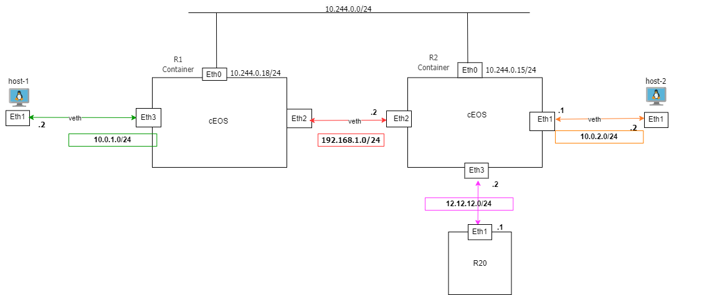

###  Add a new pod to a topology

To make dynamic changes to an existing topology already created with KNE, such as creating a new node in an already established topology, create a YAML file with the pod definition. The namespace must be specified and must be the same as in the topology. Find an example in the files `new.yaml` and `new-csr.yaml`.

The `new.yaml` file creates a new container based on Alpine, while the `new-csr.yaml` file creates a container using the CSR1000v router in an already created topology with the name 2ceos.

- Once the file has been created to deploy to the cluster, the following command must be executed:


```shell
kubectl apply -f new.yaml
```
- To delete the new pod:

```shell
kubectl delete -f new.yaml
```

